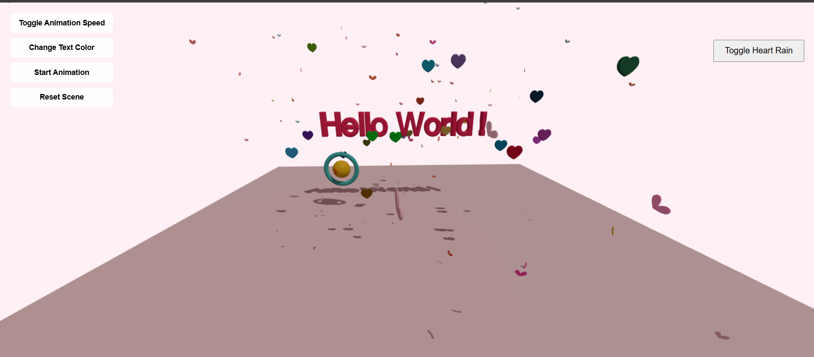

# 💖 Interactive Three.js Heart Scene

A romantic and interactive 3D scene built with Three.js featuring heart-shaped objects, animations, and dynamic controls.

## 🚀 How to Run the Project

### Quick Start

1. Clone this repository:

   ```bash
   git clone https://github.com/NyoLaeMay/threejs-miniproject.git
   cd threejs-miniproject
   ```

2. **Start a local server:**

   ```bash
   # Using npx (no installation required)
   npx serve .

   # Or using Python
   python -m http.server 8000

   # Or using Node.js
   npm install -g http-server
   http-server
   ```

3. **Open your browser** and navigate to the provided local server URL (usually `http://localhost:3000` or similar)

## ✨ Features Implemented

### 🎨 3D Objects & Graphics

- **Heart-shaped Floating Objects**: 20 randomly colored 3D heart shapes
- **Geometric Shapes**: Interactive sphere and torus with metallic materials
- **Dynamic Text**: "Hello World!" text with 3D extrusion and beveling
- **Heart Rain Effect**: 100 animated falling heart particles
- **Realistic Lighting**: Ambient, directional, and point lights with soft shadows
- **Pastel Color Palette**: Romantic color scheme with soft pink background

### 🎮 Interactive Controls

- **Mouse Orbit Controls**: Rotate, zoom, and pan around the 3D scene
- **Animation Toggle**: Start/stop all object animations
- **Speed Control**: Cycle through different animation speeds (1x, 3x, 0.5x)
- **Text Color Changer**: Cycle through 6 different vibrant text colors
- **Scene Reset**: Return all objects to their initial positions and states
- **Heart Rain Toggle**: Turn the falling hearts effect on/off

## 🧠 Key Learnings

• **Three.js Scene, Camera, Renderer are essential** - took time to understand how they work together  
• **Bézier curves for custom heart shapes** - math was challenging but creates beautiful 3D geometry  
• **Time-based animation prevents speed issues** - frame-based animations run differently on each device  
• **Math.sin() and Math.cos() create natural motion** - perfect for bouncing, floating, and circular movements  
• **Interactive UI controls need state management** - syncing buttons with 3D animations is complex

## 🌐 Live Demo

Visit the live demo: (https://threejs-miniproject.vercel.app)

## 📸 Screenshots


